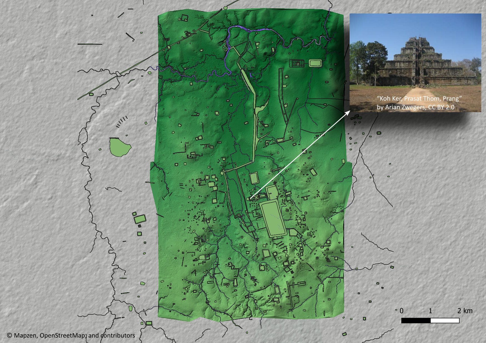

# Publications

  <article class="publication-card">
    <picture>
      <source type="image/webp" srcset="images/kk_site_area_900.webp 900w, images/kk_site_area.webp 1750w" sizes="(max-width: 768px) 100vw, 768px">
      
    </picture>
    
2026 · Journal of Archaeological Science · Volume 193

    <h2>Bayesian modelling of the latent human influence field in archaeological urban sediments at Koh Ker, Cambodia</h2>
    
W. Christopher Carleton, Thon Tho, David Brotherson, Samnang Phin, Huw Groucutt, Jürgen Renn, and Patrick Roberts

    <a class="publication-link" href="https://www.sciencedirect.com/science/article/pii/S0305440326001937">Read the article ↗</a>
    <a class="publication-update-link" href="updates/update-latent-human-influence-field.html">Project story coming soon</a>
  </article>

