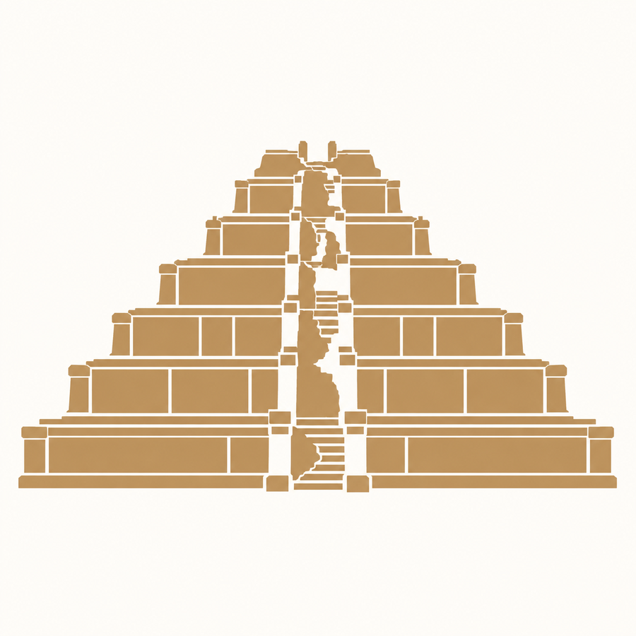

# Field Updates

Stories from the PURA project, from fieldwork to published research.

```{=html}
<div class="updates-grid">
  <article class="update-card">
    
    <div class="update-card-content">
      <p class="update-meta">Fieldwork · March 2026</p>
      <h2><a href="updates/update-fieldwork-032026.html">Coring across Koh Ker</a></h2>
      <p>More than 30 new sediment cores, a ritual pond, and a memorable return to the field.</p>
      <a class="update-read-link" href="updates/update-fieldwork-032026.html">Read update <span aria-hidden="true">→</span></a>
    </div>
  </article>
  <article class="update-card">
    
    <div class="update-card-content">
      <p class="update-meta">Research · Story coming soon</p>
      <h2><a href="updates/update-latent-human-influence-field.html">Bayesian modelling at Koh Ker</a></h2>
      <p>A closer look at how the project combines magnetic susceptibility and ceramic data to study traces of past activity in urban sediments.</p>
      <a class="update-read-link" href="updates/update-latent-human-influence-field.html">About this story <span aria-hidden="true">→</span></a>
    </div>
  </article>
</div>
```
